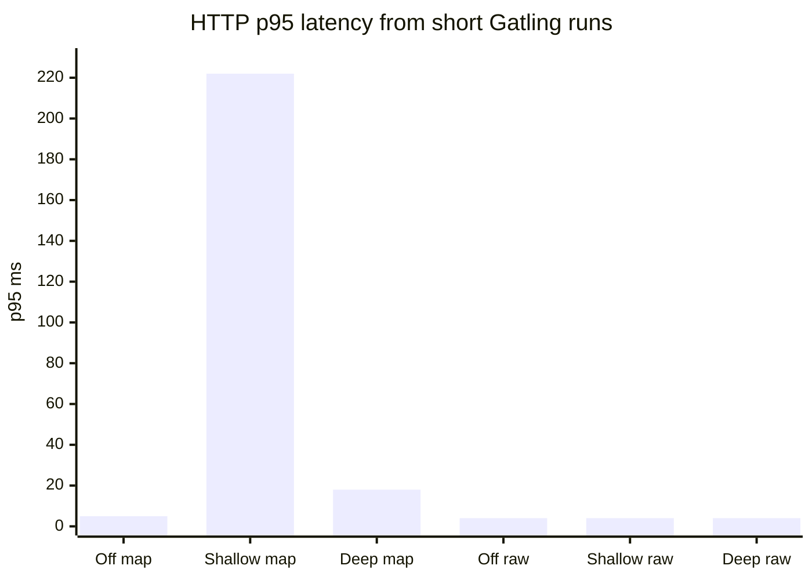

# Extensions Validator Benchmark Report

This report combines the latest isolated JMH results with short HTTP/Gatling runs against the dedicated perf endpoints.

Source data:

- JMH JSON: [extensions-validator.json](/Users/hectorad/Developer/gs-validating-form-input/complete/target/jmh-results/extensions-validator.json)
- Gatling off/map: [index.html](/Users/hectorad/Developer/gs-validating-form-input/complete/target/gatling/formvalidationsimulation-20260415223007522/index.html)
- Gatling off/raw: [index.html](/Users/hectorad/Developer/gs-validating-form-input/complete/target/gatling/formvalidationsimulation-20260415223024161/index.html)
- Gatling shallow/map: [index.html](/Users/hectorad/Developer/gs-validating-form-input/complete/target/gatling/formvalidationsimulation-20260415223110463/index.html)
- Gatling shallow/raw: [index.html](/Users/hectorad/Developer/gs-validating-form-input/complete/target/gatling/formvalidationsimulation-20260415223128606/index.html)
- Gatling deep/map: [index.html](/Users/hectorad/Developer/gs-validating-form-input/complete/target/gatling/formvalidationsimulation-20260415223210016/index.html)
- Gatling deep/raw: [index.html](/Users/hectorad/Developer/gs-validating-form-input/complete/target/gatling/formvalidationsimulation-20260415223231987/index.html)

The old `POST /` form endpoint is not used here because it does not bind `extensions` JSON into the form object. All HTTP numbers below come from the dedicated perf endpoints:

- `POST /perf/validate/extensions/map`
- `POST /perf/validate/extensions/raw`

## Executive Summary

- Turning validation off drops the isolated cost to about `0.146-0.149 us/op`, compared with `0.827-0.911 us/op` for baseline validation without any `Extensions` rule.
- On the same deep payload, the shallow extension rule adds `0.444 us/op` on `Map<String,Object>` and `0.714 us/op` on raw JSON strings over baseline.
- Switching from shallow JSONPath to deep JSONPath on the same deep body adds another `0.499 us/op` on `Map<String,Object>` and `0.491 us/op` on raw JSON.
- Raw JSON adds a measurable parse penalty over matching map scenarios, topping out at `+0.314 us/op` when the shallow rule is run against the deep payload.

The isolated JMH numbers make the main story clear: validation-off vs baseline is a large fixed cost, raw JSON adds parsing overhead, and deep traversal is more expensive than the shallow rule on the same body. The short HTTP runs confirm the dedicated endpoints work under load with `0%` errors, but they are much noisier than JMH and should be treated as end-to-end sanity checks rather than the source of micro-cost truth.

## JMH Absolute Cost

Deep payload, same body across modes:

```mermaid
xychart-beta
    title "JMH absolute cost on deep payload"
    x-axis ["Off","Baseline","Shallow path","Deep path"]
    y-axis "us/op" 0 --> 2.3
    bar "Map" [0.147, 0.867, 1.311, 1.810]
    bar "Raw JSON" [0.146, 0.911, 1.625, 2.116]
```

Shallow payload:

```mermaid
xychart-beta
    title "JMH absolute cost on shallow payload"
    x-axis ["Off","Baseline","Shallow path"]
    y-axis "us/op" 0 --> 1.5
    bar "Map" [0.149, 0.827, 1.232]
    bar "Raw JSON" [0.148, 0.890, 1.356]
```

| Scenario | Avg (`us/op`) | Error (`us/op`) |
| --- | ---: | ---: |
| `off_map_shallow_payload` | `0.149` | `0.002` |
| `off_map_deep_payload` | `0.147` | `0.002` |
| `baseline_map_shallow_payload` | `0.827` | `0.028` |
| `baseline_map_deep_payload` | `0.867` | `0.020` |
| `shallow_path_on_map_shallow_payload` | `1.232` | `0.041` |
| `shallow_path_on_map_deep_payload` | `1.311` | `0.015` |
| `deep_path_on_map_deep_payload` | `1.810` | `0.090` |
| `off_json_shallow_payload` | `0.148` | `0.003` |
| `off_json_deep_payload` | `0.146` | `0.002` |
| `baseline_json_shallow_payload` | `0.890` | `0.016` |
| `baseline_json_deep_payload` | `0.911` | `0.010` |
| `shallow_path_on_json_shallow_payload` | `1.356` | `0.049` |
| `shallow_path_on_json_deep_payload` | `1.625` | `0.053` |
| `deep_path_on_json_deep_payload` | `2.116` | `0.056` |

## JMH Delta View

Non-extension validation cost:

| Comparison | Formula | Added cost (`us/op`) | Increase |
| --- | --- | ---: | ---: |
| Map shallow baseline vs off | `0.827 - 0.149` | `0.678` | `455.0%` |
| Map deep baseline vs off | `0.867 - 0.147` | `0.720` | `489.8%` |
| Raw shallow baseline vs off | `0.890 - 0.148` | `0.742` | `501.4%` |
| Raw deep baseline vs off | `0.911 - 0.146` | `0.765` | `524.0%` |

Extension overhead:

| Comparison | Formula | Added cost (`us/op`) | Increase |
| --- | --- | ---: | ---: |
| Map shallow rule on shallow payload | `1.232 - 0.827` | `0.405` | `49.0%` |
| Map shallow rule on deep payload | `1.311 - 0.867` | `0.444` | `51.2%` |
| Map deep traversal on deep payload | `1.810 - 1.311` | `0.499` | `38.1%` |
| Raw shallow rule on shallow payload | `1.356 - 0.890` | `0.466` | `52.4%` |
| Raw shallow rule on deep payload | `1.625 - 0.911` | `0.714` | `78.4%` |
| Raw deep traversal on deep payload | `2.116 - 1.625` | `0.491` | `30.2%` |

Raw JSON parse overhead vs matching map scenario:

| Comparison | Formula | Added cost (`us/op`) | Increase |
| --- | --- | ---: | ---: |
| Baseline shallow raw vs map | `0.890 - 0.827` | `0.063` | `7.6%` |
| Baseline deep raw vs map | `0.911 - 0.867` | `0.044` | `5.1%` |
| Shallow rule on shallow payload raw vs map | `1.356 - 1.232` | `0.124` | `10.1%` |
| Shallow rule on deep payload raw vs map | `1.625 - 1.311` | `0.314` | `24.0%` |
| Deep rule on deep payload raw vs map | `2.116 - 1.810` | `0.306` | `16.9%` |

## HTTP / Gatling

These Gatling numbers come from short `50 rps`, `2s warmup`, `5s duration` runs on the same deep payload. They are useful as end-to-end smoke results, but they are much noisier than JMH because they include HTTP, Tomcat, Jackson request-body binding, and normal runtime jitter.

| Mode | Endpoint | Payload | Mean (`ms`) | p50 (`ms`) | p95 (`ms`) | Throughput (`rps`) | Error rate | Artifact |
| --- | --- | --- | ---: | ---: | ---: | ---: | ---: | --- |
| `off` | `/perf/validate/extensions/map` | `deep` | `10` | `3` | `5` | `50` | `0.0%` | [report](/Users/hectorad/Developer/gs-validating-form-input/complete/target/gatling/formvalidationsimulation-20260415223007522/index.html) |
| `off` | `/perf/validate/extensions/raw` | `deep` | `7` | `3` | `4` | `50` | `0.0%` | [report](/Users/hectorad/Developer/gs-validating-form-input/complete/target/gatling/formvalidationsimulation-20260415223024161/index.html) |
| `shallow` | `/perf/validate/extensions/map` | `deep` | `26` | `3` | `222` | `50` | `0.0%` | [report](/Users/hectorad/Developer/gs-validating-form-input/complete/target/gatling/formvalidationsimulation-20260415223110463/index.html) |
| `shallow` | `/perf/validate/extensions/raw` | `deep` | `7` | `3` | `4` | `50` | `0.0%` | [report](/Users/hectorad/Developer/gs-validating-form-input/complete/target/gatling/formvalidationsimulation-20260415223128606/index.html) |
| `deep` | `/perf/validate/extensions/map` | `deep` | `12` | `3` | `18` | `50` | `0.0%` | [report](/Users/hectorad/Developer/gs-validating-form-input/complete/target/gatling/formvalidationsimulation-20260415223210016/index.html) |
| `deep` | `/perf/validate/extensions/raw` | `deep` | `7` | `3` | `4` | `50` | `0.0%` | [report](/Users/hectorad/Developer/gs-validating-form-input/complete/target/gatling/formvalidationsimulation-20260415223231987/index.html) |

## Interpretation

The JMH side is the reliable signal:

- validation-off establishes the floor at roughly `0.15 us/op`
- baseline validation adds about `0.68-0.77 us/op`
- the shallow `Extensions` rule adds about `0.41-0.71 us/op`
- deep traversal adds another `0.49-0.50 us/op` on the same deep body
- raw JSON parsing adds another `0.04-0.31 us/op` depending on the scenario

The HTTP numbers are still useful, but they answer a different question:

- do the dedicated endpoints work under load?
- does each mode stay error-free?
- is there any obvious request-path regression large enough to show up above framework noise?

For this short run, all six HTTP scenarios stayed at `0%` errors and held the configured `50 rps`. The map path shows more visible latency variance than the raw path in these short samples, especially the shallow-map run, which is a reminder that end-to-end latency can be dominated by occasional framework or JVM outliers rather than the validator’s micro-cost alone.
