# Extensions Validator Benchmark Report

This report reflects the current shopping-cart perf model. The validated field is still `extensions`, but the payload inside it is now a shopping cart:

- shallow path: `$.cartCode`
- deep path: `$.items[*].productOffering.tags.catalogCode`

The deep payload also includes the top-level `cartCode`, which lets us run the shallow rule against the same deep body and separate payload-size cost from traversal-depth cost.

All timed JMH scenarios in this report use valid payloads only. Invalid payloads are still exercised in setup assertions and endpoint tests, but they are not part of the measured benchmark methods.

Run settings used for this report:

- JMH: `2` forks, `5 x 1s` warmup iterations, `10 x 1s` measurement iterations, average time in microseconds

Source data:

- JMH JSON: [extensions-validator.json](/Users/hectorad/Developer/gs-validating-form-input/complete/target/jmh-results/extensions-validator.json)

## Model under test

The wrapper request model is shopping-cart-shaped too. Its baseline non-extension fields are:

- `cartId`
- `customerId`
- `currency`
- `totalAmount`

The `extensions` value is either:

- `Map<String, Object>` for the map scenarios
- raw JSON `String` for the raw scenarios

Payload examples:

- shallow payload: `{"cartCode":"ABC-1234"}`
- deep payload: `{"cartCode":"ABC-1234","items":[{"productOffering":{"name":"Fiber 500","tags":{"catalogCode":"ABC-1234","channel":"digital"}}},{"productOffering":{"name":"Fiber 800","tags":{"catalogCode":"DEF-5678","channel":"digital"}}},{"productOffering":{"name":"Fiber 1000","tags":{"catalogCode":"GHI-9012","channel":"digital"}}}]}`

## Executive Summary

- validation off stays at the floor, about `0.146-0.149 us/op`
- baseline Bean Validation without `Extensions` costs about `1.108-1.187 us/op` over that floor
- on the same deep shopping-cart payload, the shallow rule adds `0.385 us/op` on `Map<String, Object>` and `1.391 us/op` on raw JSON over baseline
- switching from `$.cartCode` to `$.items[*].productOffering.tags.catalogCode` on that same deep body adds another `0.832 us/op` on `Map<String, Object>` and `0.706 us/op` on raw JSON
- in the extension-enabled scenarios, raw JSON is slower than the map representation by `0.366-0.972 us/op`

## JMH Absolute Cost

Deep payload, same shopping-cart body across validation modes:

```mermaid
xychart-beta
    title "JMH absolute cost on deep shopping-cart payload"
    x-axis ["Off","Baseline","Shallow path","Deep path"]
    y-axis "us/op" 0 --> 3.7
    bar "Map" [0.149, 1.288, 1.673, 2.505]
    bar "Raw JSON" [0.146, 1.254, 2.645, 3.351]
```

Shallow payload:

```mermaid
xychart-beta
    title "JMH absolute cost on shallow shopping-cart payload"
    x-axis ["Off","Baseline","Shallow path"]
    y-axis "us/op" 0 --> 2.2
    bar "Map" [0.147, 1.334, 1.549]
    bar "Raw JSON" [0.147, 1.290, 1.915]
```

| Scenario | Avg (`us/op`) |
| --- | ---: |
| `off_map_shallow_payload` | `0.147` |
| `off_map_deep_payload` | `0.149` |
| `baseline_map_shallow_payload` | `1.334` |
| `baseline_map_deep_payload` | `1.288` |
| `shallow_path_on_map_shallow_payload` | `1.549` |
| `shallow_path_on_map_deep_payload` | `1.673` |
| `deep_path_on_map_deep_payload` | `2.505` |
| `off_json_shallow_payload` | `0.147` |
| `off_json_deep_payload` | `0.146` |
| `baseline_json_shallow_payload` | `1.290` |
| `baseline_json_deep_payload` | `1.254` |
| `shallow_path_on_json_shallow_payload` | `1.915` |
| `shallow_path_on_json_deep_payload` | `2.645` |
| `deep_path_on_json_deep_payload` | `3.351` |

## JMH Delta View

Non-extension validation cost:

| Comparison | Formula | Added cost (`us/op`) | Increase |
| --- | --- | ---: | ---: |
| Map shallow baseline vs off | `1.334 - 0.147` | `1.187` | `807.5%` |
| Map deep baseline vs off | `1.288 - 0.149` | `1.139` | `764.4%` |
| Raw shallow baseline vs off | `1.290 - 0.147` | `1.143` | `777.6%` |
| Raw deep baseline vs off | `1.254 - 0.146` | `1.108` | `758.9%` |

Extension-rule overhead:

| Comparison | Formula | Added cost (`us/op`) | Increase |
| --- | --- | ---: | ---: |
| Map shallow rule on shallow payload | `1.549 - 1.334` | `0.215` | `16.1%` |
| Map shallow rule on deep payload | `1.673 - 1.288` | `0.385` | `29.9%` |
| Map deep traversal on deep payload | `2.505 - 1.673` | `0.832` | `49.7%` |
| Raw shallow rule on shallow payload | `1.915 - 1.290` | `0.625` | `48.4%` |
| Raw shallow rule on deep payload | `2.645 - 1.254` | `1.391` | `110.9%` |
| Raw deep traversal on deep payload | `3.351 - 2.645` | `0.706` | `26.7%` |

Raw JSON vs `Map<String, Object>` on the same scenario:

| Comparison | Formula | Added cost (`us/op`) | Increase |
| --- | --- | ---: | ---: |
| Baseline shallow raw vs map | `1.290 - 1.334` | `-0.044` | `-3.3%` |
| Baseline deep raw vs map | `1.254 - 1.288` | `-0.034` | `-2.6%` |
| Shallow rule on shallow payload raw vs map | `1.915 - 1.549` | `0.366` | `23.6%` |
| Shallow rule on deep payload raw vs map | `2.645 - 1.673` | `0.972` | `58.1%` |
| Deep rule on deep payload raw vs map | `3.351 - 2.505` | `0.846` | `33.8%` |

Important note: the baseline raw-vs-map rows are not pure parse-cost measurements, because the raw JSON parse path is only exercised when an `Extensions` rule is active. The extension-enabled rows are the cleaner raw-vs-map comparison.

## Interpretation

The shopping-cart benchmark answers the main questions clearly:

- validation off shows the framework floor, roughly `0.146-0.149 us/op`
- baseline Bean Validation on the cart wrapper adds about `1.108-1.187 us/op`
- re-running the same shallow JSONPath against the deeper cart body adds `0.124 us/op` for map and `0.730 us/op` for raw JSON compared with the shallow-body version
- moving from the shallow cart path to the deep wildcard path on that same deep body adds the larger traversal cost
- raw JSON is measurably slower than `Map<String, Object>` once the `Extensions` validator is actually active

The most direct comparisons are:

- shallow rule on shallow cart payload vs shallow baseline:
  `+0.215 us/op` for map, `+0.625 us/op` for raw
- shallow rule on deep cart payload vs deep baseline:
  `+0.385 us/op` for map, `+1.391 us/op` for raw
- deep path vs shallow path on the same deep cart payload:
  `+0.832 us/op` for map, `+0.706 us/op` for raw

## HTTP / Gatling Harness

The HTTP perf path is already updated to the shopping-cart model:

- `POST /perf/validate/extensions/map`
- `POST /perf/validate/extensions/raw`
- `FormValidationSimulation` now builds shopping-cart request bodies from `PerfPayloadFixtures`
- the shallow/deep rules use `$.cartCode` and `$.items[*].productOffering.tags.catalogCode`

I intentionally did not carry forward the older vendor/contact HTTP latency tables into this report. Those runs were taken before the shopping-cart model swap, so keeping them here would mix stale end-to-end numbers with the new JMH model. When the HTTP matrix is rerun, this report can add a fresh p50/p95/throughput section for the shopping-cart payloads too.
