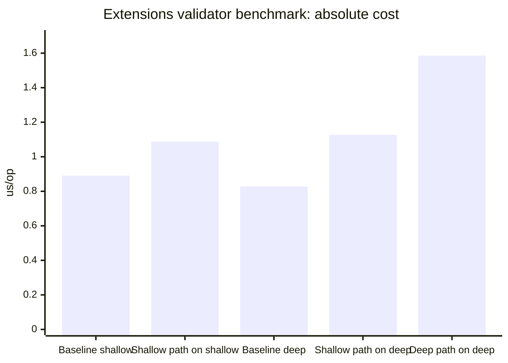
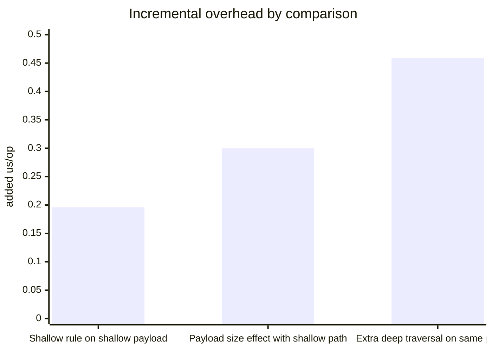

# Extensions Validator Benchmark Report

This report summarizes the latest JMH run for `ExtensionsValidatorBenchmark` using the Maven default benchmark settings:

- 2 forks
- 5 warmup iterations at 1 second each
- 10 measurement iterations at 1 second each
- average time mode
- microseconds per operation (`us/op`)

Source data: [extensions-validator.json](/Users/hectorad/Developer/gs-validating-form-input/complete/target/jmh-results/extensions-validator.json)

## Executive Summary

- The shallow `$.vendorExtensionCode` rule adds about `0.196 us/op` on the shallow payload, a `22.1%` increase over the shallow baseline.
- Running that same shallow rule against the larger deep payload adds about `0.300 us/op`, a `36.2%` increase over the deep baseline.
- Switching from the shallow JSONPath to the deep JSONPath on the exact same deep payload adds another `0.459 us/op`, a `40.7%` increase over `shallow_path_on_deep_payload`.
- End to end, the deep traversal rule is about `1.586 us/op`, which is `91.6%` higher than the deep-payload baseline.

The main takeaway is that payload size alone is not the dominant cost here. The bigger jump comes from the deeper JSONPath traversal and the wildcard iteration across the 3 `codes[*].value` candidates.

## Absolute Timings



| Scenario | Avg (`us/op`) | Error (`us/op`) | Interpretation |
| --- | ---: | ---: | --- |
| `baseline_shallow_payload` | `0.891` | `0.009` | Bean Validation cost with shallow payload and no `Extensions` rule |
| `shallow_path_on_shallow_payload` | `1.087` | `0.058` | Shallow rule on the small payload |
| `baseline_deep_payload` | `0.828` | `0.007` | Bean Validation cost with the larger deep payload and no `Extensions` rule |
| `shallow_path_on_deep_payload` | `1.127` | `0.004` | Same deep payload, but only the shallow top-level JSONPath |
| `deep_path_on_deep_payload` | `1.586` | `0.025` | Deep traversal plus wildcard iteration over 3 candidates |

## Comparison View



| Comparison | Formula | Added cost (`us/op`) | Increase |
| --- | --- | ---: | ---: |
| Shallow rule overhead on small payload | `shallow_path_on_shallow_payload - baseline_shallow_payload` | `0.196` | `22.1%` |
| Payload-size effect while keeping path shallow | `shallow_path_on_deep_payload - baseline_deep_payload` | `0.300` | `36.2%` |
| Traversal-depth effect on same deep payload | `deep_path_on_deep_payload - shallow_path_on_deep_payload` | `0.459` | `40.7%` |
| Total deep-rule cost vs deep baseline | `deep_path_on_deep_payload - baseline_deep_payload` | `0.758` | `91.6%` |

## Interpretation

The baseline numbers are close together:

- shallow baseline: `0.891 us/op`
- deep baseline: `0.828 us/op`

That tells us the larger payload by itself is not creating a meaningful penalty in this benchmark. If payload size alone were the main factor, `baseline_deep_payload` would clearly exceed `baseline_shallow_payload`, and it does not.

The more important pattern is:

1. `shallow_path_on_deep_payload` is only moderately above the deep baseline.
2. `deep_path_on_deep_payload` jumps much more on the same body.

That isolates the expensive part to the extra JSONPath work:

- deeper object traversal
- wildcard expansion
- validating 3 resolved candidates instead of 1 top-level value

## Reproduce

Run the full benchmark:

```bash
./mvnw jmh:benchmark -Djmh.benchmarks=ExtensionsValidatorBenchmark
```

Run the faster smoke version:

```bash
./mvnw jmh:benchmark \
  -Djmh.benchmarks=ExtensionsValidatorBenchmark \
  -Djmh.f=1 -Djmh.wi=1 -Djmh.i=1 -Djmh.w=200ms -Djmh.r=200ms
```
