# Extensions Validator Benchmark Report

This report reflects a fresh extended rerun after the earlier results were likely affected by local machine activity. All timed scenarios in this rerun use valid payloads only. No invalid payload case was included in the measured JMH methods or the HTTP load-test scenarios.

Run settings used for this report:

- JMH: `1` fork, `1 x 30s` warmup iteration, `2 x 30s` measurement iterations, `21m21s` total suite time
- Gatling: `30s` warmup, `300s` steady-state, `50 rps`, `16,500` requests per scenario

Source data:

- JMH JSON: [extensions-validator.json](/Users/hectorad/Developer/gs-validating-form-input/complete/target/jmh-results/extensions-validator.json)
- Gatling off/map: [index.html](/Users/hectorad/Developer/gs-validating-form-input/complete/target/gatling/formvalidationsimulation-20260416102854786/index.html)
- Gatling off/raw: [index.html](/Users/hectorad/Developer/gs-validating-form-input/complete/target/gatling/formvalidationsimulation-20260416103435946/index.html)
- Gatling shallow/map: [index.html](/Users/hectorad/Developer/gs-validating-form-input/complete/target/gatling/formvalidationsimulation-20260416104055865/index.html)
- Gatling shallow/raw: [index.html](/Users/hectorad/Developer/gs-validating-form-input/complete/target/gatling/formvalidationsimulation-20260416104636168/index.html)
- Gatling deep/map: [index.html](/Users/hectorad/Developer/gs-validating-form-input/complete/target/gatling/formvalidationsimulation-20260416105240152/index.html)
- Gatling deep/raw: [index.html](/Users/hectorad/Developer/gs-validating-form-input/complete/target/gatling/formvalidationsimulation-20260416105820601/index.html)

The old `POST /` form endpoint is intentionally not used here because it does not bind `extensions` JSON into the form object. All HTTP numbers below come from the dedicated perf endpoints:

- `POST /perf/validate/extensions/map`
- `POST /perf/validate/extensions/raw`

## Executive Summary

- Validation-off is still the floor at about `0.145-0.152 us/op`.
- Baseline Bean Validation without any `Extensions` rule lands around `0.769-0.903 us/op`.
- On the same deep payload, the shallow extension rule adds `0.536 us/op` on `Map<String,Object>` and `0.648 us/op` on raw JSON over baseline.
- Switching from the shallow JSONPath to the deep JSONPath on that same deep payload adds another `0.605 us/op` on `Map<String,Object>` and `0.450 us/op` on raw JSON.
- Raw JSON is still slower than `Map<String,Object>` for the shallow-rule scenarios, but in this longer rerun the deep-rule raw-vs-map gap nearly disappears at `+0.003 us/op`.

The isolated JMH numbers are still the main source of truth for validator cost. The longer HTTP runs are useful because they show the request path stayed stable for more than five minutes per scenario, but at `50 rps` the full-stack latency differences mostly collapse into the same `1-3 ms` band.

## JMH Absolute Cost

Deep payload, same body across validation modes:

```mermaid
xychart-beta
    title "JMH absolute cost on deep payload (30s warmup, 2 x 30s measure)"
    x-axis ["Off","Baseline","Shallow path","Deep path"]
    y-axis "us/op" 0 --> 2.1
    bar "Map" [0.145, 0.769, 1.305, 1.910]
    bar "Raw JSON" [0.145, 0.814, 1.462, 1.912]
```

Shallow payload:

```mermaid
xychart-beta
    title "JMH absolute cost on shallow payload (30s warmup, 2 x 30s measure)"
    x-axis ["Off","Baseline","Shallow path"]
    y-axis "us/op" 0 --> 1.6
    bar "Map" [0.152, 0.866, 1.297]
    bar "Raw JSON" [0.147, 0.903, 1.425]
```

| Scenario | Avg (`us/op`) |
| --- | ---: |
| `off_map_shallow_payload` | `0.152` |
| `off_map_deep_payload` | `0.145` |
| `baseline_map_shallow_payload` | `0.866` |
| `baseline_map_deep_payload` | `0.769` |
| `shallow_path_on_map_shallow_payload` | `1.297` |
| `shallow_path_on_map_deep_payload` | `1.305` |
| `deep_path_on_map_deep_payload` | `1.910` |
| `off_json_shallow_payload` | `0.147` |
| `off_json_deep_payload` | `0.145` |
| `baseline_json_shallow_payload` | `0.903` |
| `baseline_json_deep_payload` | `0.814` |
| `shallow_path_on_json_shallow_payload` | `1.425` |
| `shallow_path_on_json_deep_payload` | `1.462` |
| `deep_path_on_json_deep_payload` | `1.912` |

## JMH Delta View

Validation-on vs validation-off:

| Comparison | Formula | Added cost (`us/op`) | Increase |
| --- | --- | ---: | ---: |
| Map shallow baseline vs off | `0.866 - 0.152` | `0.714` | `470.2%` |
| Map deep baseline vs off | `0.769 - 0.145` | `0.624` | `429.6%` |
| Raw shallow baseline vs off | `0.903 - 0.147` | `0.756` | `514.5%` |
| Raw deep baseline vs off | `0.814 - 0.145` | `0.670` | `463.4%` |

Extension-rule overhead:

| Comparison | Formula | Added cost (`us/op`) | Increase |
| --- | --- | ---: | ---: |
| Map shallow rule on shallow payload | `1.297 - 0.866` | `0.431` | `49.8%` |
| Map shallow rule on deep payload | `1.305 - 0.769` | `0.536` | `69.7%` |
| Map deep traversal on deep payload | `1.910 - 1.305` | `0.605` | `46.4%` |
| Raw shallow rule on shallow payload | `1.425 - 0.903` | `0.522` | `57.8%` |
| Raw shallow rule on deep payload | `1.462 - 0.814` | `0.648` | `79.6%` |
| Raw deep traversal on deep payload | `1.912 - 1.462` | `0.450` | `30.8%` |

Raw JSON vs `Map<String,Object>` on the same scenario:

| Comparison | Formula | Added cost (`us/op`) | Increase |
| --- | --- | ---: | ---: |
| Baseline shallow raw vs map | `0.903 - 0.866` | `0.037` | `4.3%` |
| Baseline deep raw vs map | `0.814 - 0.769` | `0.045` | `5.9%` |
| Shallow rule on shallow payload raw vs map | `1.425 - 1.297` | `0.128` | `9.8%` |
| Shallow rule on deep payload raw vs map | `1.462 - 1.305` | `0.157` | `12.1%` |
| Deep rule on deep payload raw vs map | `1.912 - 1.910` | `0.003` | `0.1%` |

Important note: the two baseline raw-vs-map rows are still not pure parse-cost measurements, because the raw JSON parse path is only exercised when an `Extensions` rule is active. The stronger raw-vs-map signal is in the extension-enabled rows.

## HTTP / Gatling

These Gatling numbers come from long `50 rps`, `30s warmup`, `300s duration` runs on the deep payload. Each scenario completed `16,500` requests with `0%` errors, so this section is useful as a request-path stability check over a much longer window than the earlier short run.

```mermaid
xychart-beta
    title "HTTP latency from 30s warmup + 5m sustained run"
    x-axis ["Off map","Shallow map","Deep map","Off raw","Shallow raw","Deep raw"]
    y-axis "ms" 0 --> 5
    bar "Mean" [2, 2, 2, 1, 2, 2]
    bar "p95" [3, 3, 3, 3, 3, 3]
```

| Mode | Endpoint | Payload | Mean (`ms`) | p50 (`ms`) | p75 (`ms`) | p95 (`ms`) | p99 (`ms`) | Max (`ms`) | Throughput (`rps`) | Requests | Error rate | Artifact |
| --- | --- | --- | ---: | ---: | ---: | ---: | ---: | ---: | ---: | ---: | ---: | --- |
| `off` | `/perf/validate/extensions/map` | `deep` | `2` | `2` | `2` | `3` | `4` | `376` | `50` | `16,500` | `0.0%` | [report](/Users/hectorad/Developer/gs-validating-form-input/complete/target/gatling/formvalidationsimulation-20260416102854786/index.html) |
| `off` | `/perf/validate/extensions/raw` | `deep` | `1` | `1` | `2` | `3` | `3` | `225` | `50` | `16,500` | `0.0%` | [report](/Users/hectorad/Developer/gs-validating-form-input/complete/target/gatling/formvalidationsimulation-20260416103435946/index.html) |
| `shallow` | `/perf/validate/extensions/map` | `deep` | `2` | `1` | `2` | `3` | `4` | `348` | `50` | `16,500` | `0.0%` | [report](/Users/hectorad/Developer/gs-validating-form-input/complete/target/gatling/formvalidationsimulation-20260416104055865/index.html) |
| `shallow` | `/perf/validate/extensions/raw` | `deep` | `2` | `1` | `2` | `3` | `4` | `237` | `50` | `16,500` | `0.0%` | [report](/Users/hectorad/Developer/gs-validating-form-input/complete/target/gatling/formvalidationsimulation-20260416104636168/index.html) |
| `deep` | `/perf/validate/extensions/map` | `deep` | `2` | `1` | `2` | `3` | `4` | `435` | `50` | `16,500` | `0.0%` | [report](/Users/hectorad/Developer/gs-validating-form-input/complete/target/gatling/formvalidationsimulation-20260416105240152/index.html) |
| `deep` | `/perf/validate/extensions/raw` | `deep` | `2` | `1` | `2` | `3` | `3` | `254` | `50` | `16,500` | `0.0%` | [report](/Users/hectorad/Developer/gs-validating-form-input/complete/target/gatling/formvalidationsimulation-20260416105820601/index.html) |

## Interpretation

The longer JMH rerun gives the clearest answer:

- turning validation off drops the steady-state cost to roughly `0.15 us/op`
- baseline Bean Validation adds about `0.62-0.76 us/op`
- adding the shallow `Extensions` rule adds another `0.43-0.65 us/op`
- moving from the shallow JSONPath to the deep wildcard JSONPath adds another `0.45-0.61 us/op` on the same deep body
- raw JSON remains slower on the shallow-rule path, but the deep-rule raw-vs-map gap is effectively flat in this rerun

The longer HTTP runs answer a different question:

- do the dedicated perf endpoints stay stable for a meaningful runtime?
- do off, shallow, and deep modes stay error-free under sustained load?
- does request-path latency separate cleanly enough to attribute a visible end-to-end regression?

For this extended run, all six HTTP scenarios held `50 rps`, completed `16,500` requests each, and stayed at `0%` errors. Their p95 converged to `3 ms` across every scenario, which means the validator’s micro-cost is still better read from JMH than from end-to-end HTTP latency at this load level on this machine.
